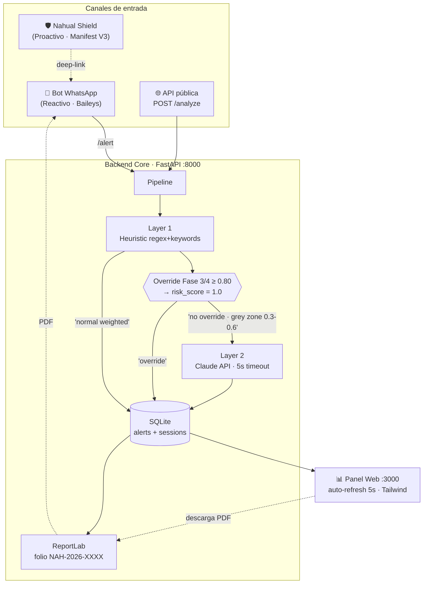
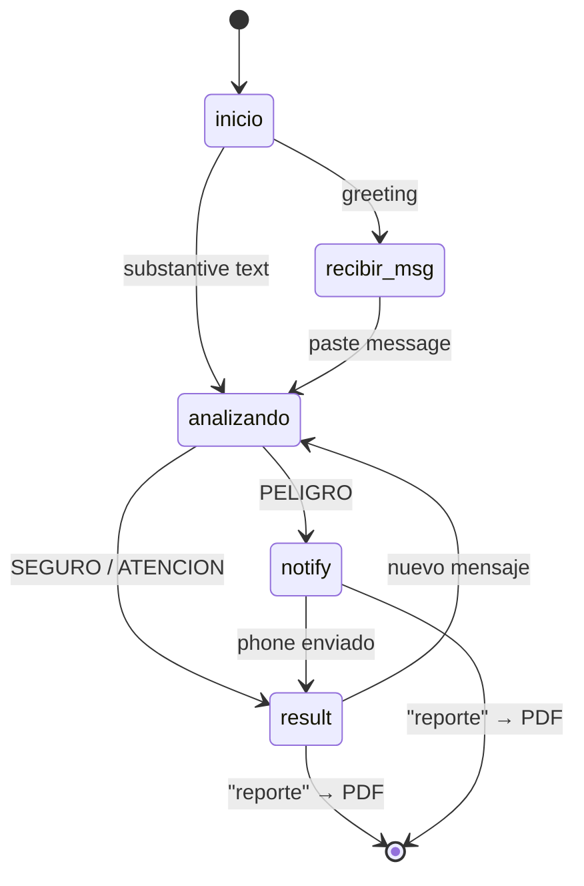
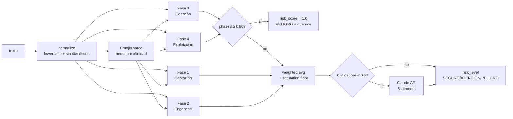

# Arquitectura — Nahual

## Vista general

## Flujo del Bot

## Lógica del clasificador

## Datos persistidos

| Campo | Almacenado | Notas |
|-------|-----------|-------|
| Texto original | ❌ | Nunca persistido (privacidad) |
| `original_text_hash` | ✅ SHA-256 | Permite detección de repeticiones sin exponer contenido |
| `summary` | ✅ Anonimizado | "Mensaje de N chars · señales: X, Y" |
| `categories` | ✅ JSON | Fases activadas + emojis detectados |
| `risk_score`, `risk_level` | ✅ | Score [0,1] + label SEGURO/ATENCION/PELIGRO |
| `override_triggered` | ✅ Bool | Marca si la regla de cortocircuito disparó |
| `contact_phone` | ⚠️ Opcional | Sólo si el menor lo provee voluntariamente |

## Cumplimiento

- **Art. 16 CPEUM** — sólo se analizan datos autoinformados; no se interceptan comunicaciones.
- **LGDNNA Art. 47** — protección integral de NNA contra reclutamiento.
- **LFPDPPP** — sin PII innecesaria; hash + summary.
- **Ley Olimpia** — protocolo activado en sextorsión (Fase 4).
