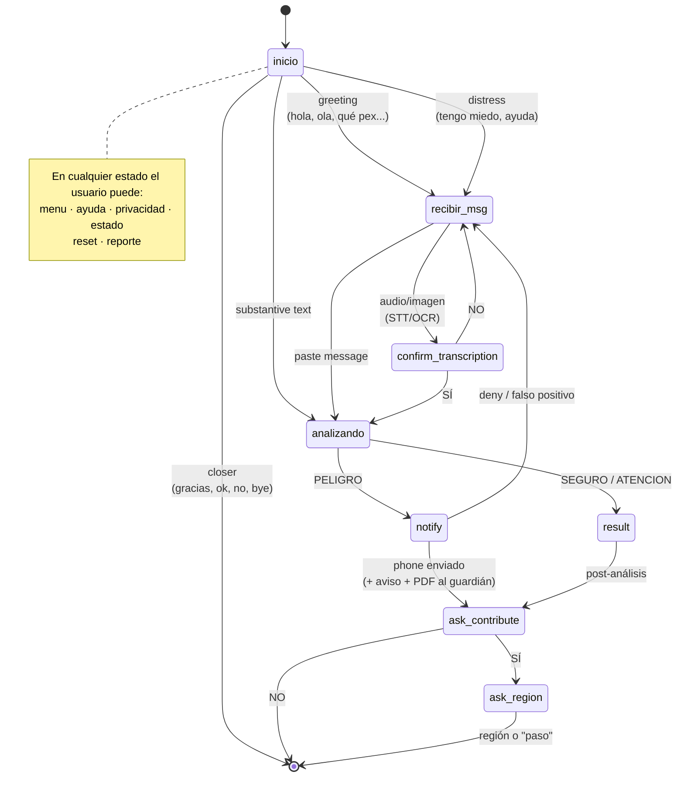
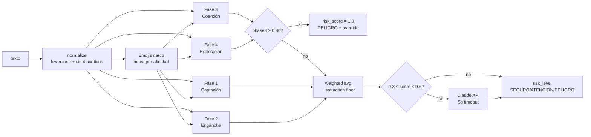
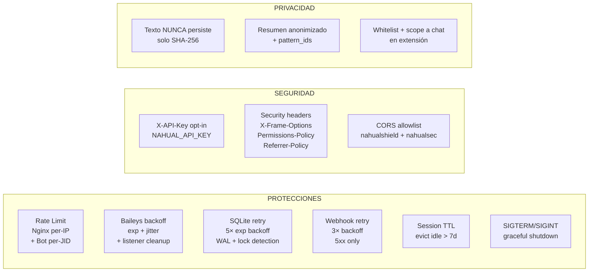

# Arquitectura — Nahual

## Vista general

```mermaid
flowchart TB
    subgraph CANALES[Canales de entrada]
        Bot["🤖 Bot WhatsApp<br/>+52 844 538 7404<br/>(Reactivo · Baileys 6.7)"]
        Ext["🛡️ Nahual Shield v1.3<br/>WA · IG · Discord · Roblox<br/>(Proactivo · Manifest V3)"]
        API["🌐 API pública<br/>POST /analyze<br/>+ /admin/* observabilidad"]
    end

    subgraph BACKEND[Backend Core · FastAPI :8000]
        direction TB
        Pipe[Pipeline]
        H[Layer 1<br/>Heuristic 768 patrones<br/>(F1 260 · F2 172 · F3 194 · F4 142)]
        L[Layer 2<br/>claude-sonnet-4-5<br/>5s timeout · zona gris 0.3-0.6]
        STT[Layer Audio<br/>Groq Whisper-large-v3]
        OCR_L[Layer Imagen<br/>Claude Vision]
        OV{{"Override Fase 3/4 ≥ 0.80<br/>→ risk_score = 1.0"}}
        DB[(SQLite + WAL<br/>retry on lock<br/>alerts + sessions + risk_history)]
        PDF[ReportLab<br/>folio NAH-2026-XXXX<br/>marco legal MX]
        WH[Webhooks outbound<br/>retry 3× backoff]
    end

    subgraph INFRA[Infra · DigitalOcean 159.223.187.6]
        Nginx[Nginx :80<br/>rate limit + security headers<br/>+ static panel]
        SystemD[systemd<br/>nahual-backend + nahual-bot]
    end

    Panel["📊 Panel Web<br/>http://159.223.187.6/<br/>auto-refresh 5s · Tailwind + Chart.js<br/>+ 🧪 manual test + 🔬 deep check"]

    Bot -->|/alert con X-API-Key| Nginx
    Ext -.deep-link wa.me.-> Bot
    API --> Nginx
    Nginx --> Pipe
    Pipe --> H
    H --> OV
    OV -- 'no override · grey zone 0.3-0.6' --> L
    L --> DB
    OV -- 'override' --> DB
    H -- 'normal weighted' --> DB
    DB --> Panel
    DB --> PDF
    PDF -.PDF.-> Bot
    Panel -.descarga PDF.-> PDF
    Bot --> STT
    Bot --> OCR_L
    DB --> WH
    WH -.alert.escalated.-> External[088 / SIPINNA / Fiscalía]
    SystemD --> Bot
    SystemD --> BACKEND
```

## Flujo del Bot



## Lógica del clasificador



## Datos persistidos

| Campo | Almacenado | Notas |
|-------|-----------|-------|
| Texto original | ❌ | Nunca persistido (privacidad) |
| `original_text_hash` | ✅ SHA-256 | Permite detección de repeticiones sin exponer contenido |
| `summary` | ✅ Anonimizado | "Mensaje de N chars · señales: X, Y" |
| `categories` | ✅ JSON | Fases activadas + emojis detectados |
| `risk_score`, `risk_level` | ✅ | Score [0,1] + label SEGURO/ATENCION/PELIGRO |
| `override_triggered` | ✅ Bool | Marca si la regla de cortocircuito disparó |
| `contact_phone` | ⚠️ Opcional | Sólo si el menor lo provee voluntariamente |

## Cumplimiento

- **Art. 16 CPEUM** — sólo se analizan datos autoinformados; no se interceptan comunicaciones.
- **LGDNNA Art. 47** — protección integral de NNA contra reclutamiento.
- **LFPDPPP** — sin PII innecesaria; hash + summary.
- **Ley Olimpia** — protocolo activado en sextorsión (Fase 4).

## Hardening de producción



## Endpoints de observabilidad (`/admin/*`)

Todos públicos, read-only, sin PII:

| Endpoint | Output |
|----------|--------|
| `/admin/version` | commit SHA + branch + commit_at + python + env |
| `/admin/dataset-info` | per-fase pattern counts + weight histogram + emojis + tuner overlay size |
| `/admin/metrics` | requests/analyze/alert/transcribe/ocr counters + uptime + alerts_in_db |
| `/admin/healthcheck-deep` | ping live a DB + Anthropic + Groq con timeouts per-check |
